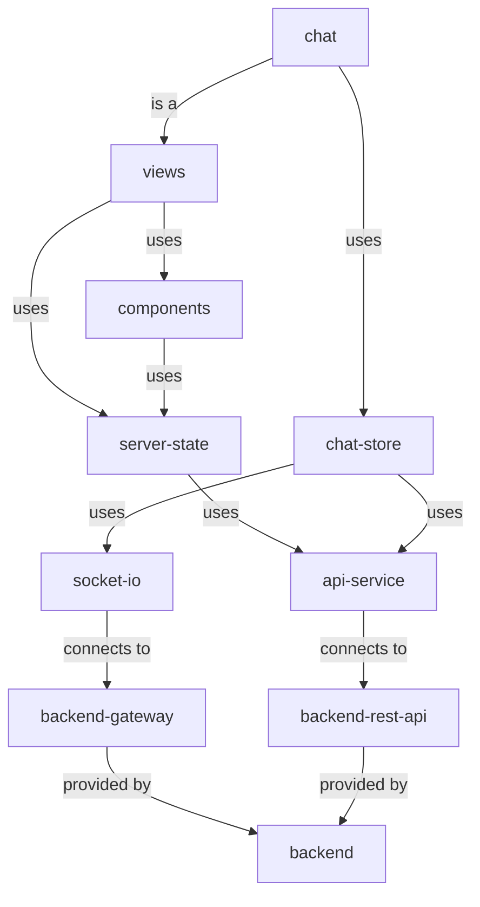

# Aula anclademia - frontend

The frontend is done by using Vue 3 and Vite.

## Data flow / architecture

- **views**: different app screens(such as auth, chat, courses, video, etc)
- **layouts**: there are 3 at the moment: main(used inside the main app), auth(for auth screens) and default(blank layout for things like 404s)
- **components**: single file Vue components.
- **server-state**: located in the `src/server-state` folder. Includes a collection of Vue composables/hooks that provide server data and mutations. A component will generally not interact directly with the ApiService and will only consume/mutate data using server-state composables. For example, useVideos(options) will provide server data about videos, and useDeleteVideo() will provide a mutation to delete a video. They are powered by Tanstack Query for Vue. They are responsible for handling data invalidation, caching, request deduping and fetching.
- **chat-store**: the main exception is chat-store. It can be seen as a black box that provides the necessary data and functions for the chat to correctly function. Chat components and views will use chat-store as the source of truth and way of dispatching events, like sending messages. chat-store uses both the ApiService and the SocketIO framework to interact with the backend.
- **api-service**: class that provides several http methods to query/mutate data. Uses axios under the hood. It is the only way to interact with the backend rest API. It handles things like common headers and errors so it is important to use it instead of plain fetch.
- **auth-service**: provides general methods like login and logout methods. Uses ApiService under the hood. Also provides a checkAuth() method that returns null if there is no current authenticated user and user information if there is.

It is important to mention that altough most of the times the data flow is driven by what is seen in the diagram, there might be exceptions where they make sense.

## Tech used

- **Internationalization**: the underlying engine is vue-i18n. It is used for client-side text and messages. The server is responsible for returning translated error messages based on the `x-lang` request header, which accepts valid locales and defaults to **en**. Valid locales are **es** and **en**.
- **Validation**: done using yup and vee-validate for forms.
- **Server interaction**: SocketIO, axios and Tanstack Query for Vue.
- **Calendar**: full-calendar.
- **Alerts/toasts**: Vue sonner and Sweetalert2.
- **PWA support**: Vite PWA plugin: `vite-plugin-pwa`.

The app follows a conventional and easy to read folder structure.

## Scripts

- `dev`: Launches a Vite dev server
- `build`: Builds and typechecks the app
- `preview`: Runs a production build
- `build-only`: Builds the app only
- `type-check`: Type checks the app
- `lint`: Runs ESLint to lint the app
- `e2e`: Opens Cypress for end-to-end testing
- `db:seed`: Runs database seeding for the backend
- `generate-pwa-assets`: Generates PWA assets for the app
